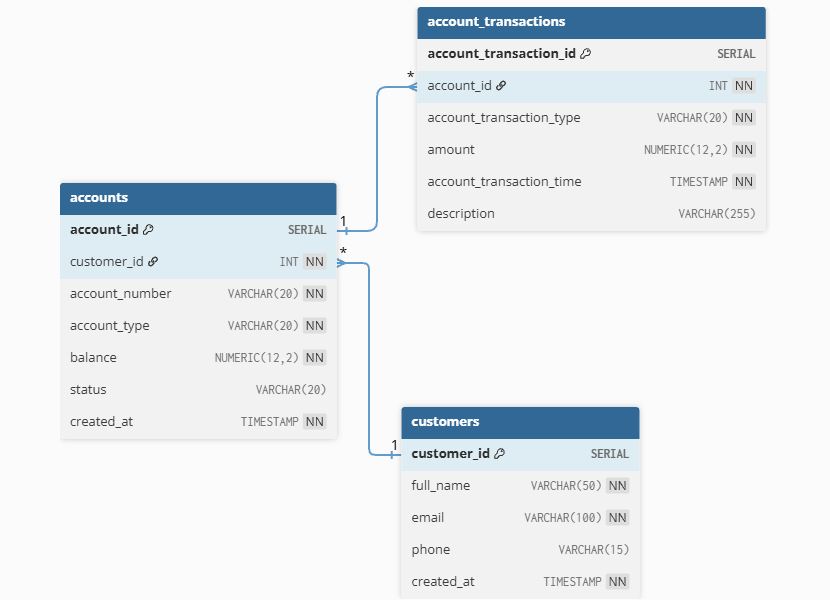

# Smart Banking System

A PostgreSQL-based Smart Banking System designed to simulate real-world banking operations using SQL and PL/pgSQL concepts.

---

## Features

- Customer and Account Management
- Deposit, Withdrawal, and Fund Transfer Operations
- Transaction History Tracking
- Trigger-based Security and Validation
- Account Status Change Logging
- Views for Reporting and Data Analysis
- Cursor-based Transaction Reports

---

## Technologies Used

- PostgreSQL
- SQL
- PL/pgSQL
- VS Code
- SQLTools Extension

---

## Project Structure

- `schema.sql` → Database schema and table creation
- `sample_data.sql` → Sample records for testing
- `queries.sql` → Basic SQL queries and reports
- `functions.sql` → Banking operation functions
- `triggers.sql` → Database triggers and validations
- `views.sql` → SQL views for reporting
- `cursors.sql` → Cursor-based reporting functions
- `testing.sql` → Testing and verification queries

---

## Database Concepts Used

- Primary Keys
- Foreign Keys
- Constraints
- Joins
- Aggregate Functions
- Subqueries
- PL/pgSQL Functions
- Triggers
- Views
- Cursors

---

## How to Run

1. Create a PostgreSQL database

2. Execute files in the following order:

   - schema.sql
   - sample_data.sql
   - queries.sql
   - functions.sql
   - triggers.sql
   - views.sql
   - cursors.sql
   - testing.sql

---

## ER Diagram

